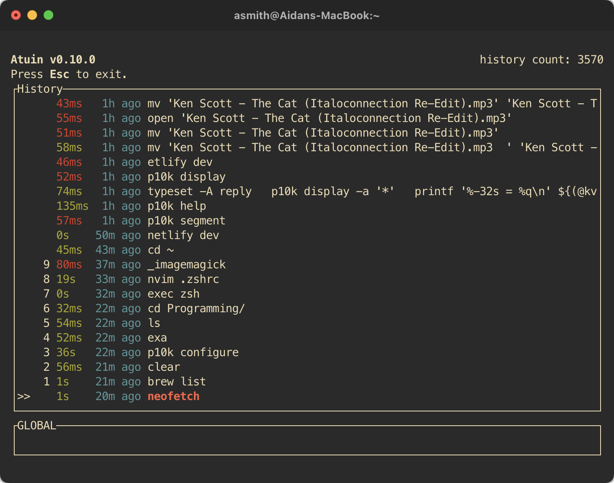
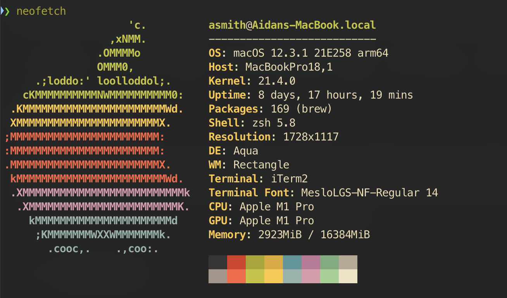

<h2>Hardware</h2>

####  [M1 Macbook Pro](https://www.apple.com/shop/buy-mac/macbook-pro/16-inch)
My first Apple machine, and I'm so happy I made the switch. The battery life on this machine easily doubles that of my previous Windows laptops along with being more powerful.

#### [Logitech MX Master 3](https://www.logitech.com/en-us/products/mice/mx-master-3s.910-006556.html)
The most comfortable mouse I've owned. Has a bunch of remappable buttons and connects reliably via Bluetooth so I don't have to carry a dongle arround. Note: If on an M1 machine, make sure to grab the newest built of the Logi Options+ app [here](https://www.logitech.com/en-us/software/logi-options-plus.html#software-download).

<h2>VS Code </h2>

I prefer VS Code for its extensibilty. Here's a list of the extensions I consider essential.

#### [Gruvbox Theme](https://marketplace.visualstudio.com/items?itemName=jdinhlife.gruvbox)
A collection of six excellent themes based on the original Vim gruvbox theme. I use Gruvbox Dark Medium.

#### [VSCode Icons](https://marketplace.visualstudio.com/items?itemName=vscode-icons-team.vscode-icons)
After going through many different file icon packs, I found VSCode Icons to have the greatest support for various file types and remaining recognizable at a glance..

#### [Bootstrap Icons](https://marketplace.visualstudio.com/items?itemName=RubenVerg.bootstrap-product-icons)
My preferred product icon pack.

#### [Remote Development Pack](https://marketplace.visualstudio.com/items?itemName=ms-vscode-remote.vscode-remote-extensionpack)
Three different extensions for enabling remote development within VS Code. I regularly use the SSH extension for developing on remote machines and the GitHub extension for checking out GitHub repositories and  making quick pull requests, all without having to clone a repository locally.

#### [VSCode Spotify](https://marketplace.visualstudio.com/items?itemName=shyykoserhiy.vscode-spotify)
I have to listen to music or podcasts while I write code, and this extension allows me to see and manage what's currently playing from VS Code directly. However, I find the Spotify interface better for switching playlists, so I hide the Spotify icon on the sidebar of VS Code by right-clicking on the sidebar and unchecking vscode-spotify.

#### [GitHub Copilot](https://github.com/features/copilot)
As a student still experimenting and learning new languages, I find GitHub Copilot enourmously helpful when working with unfamiliar languages. It handles much of the boilerplate code and often uses a languages best practices. GitHub Copilot is free for students, and I'm not sure if I'd pay the $10/month for it if it wasn't. I recommend the extension, [Copilot Labs](https://marketplace.visualstudio.com/items?itemName=GitHub.copilot-labs), for additional features such as code explaination and code translation between languages.

#### [Project Manager](https://marketplace.visualstudio.com/items?itemName=alefragnani.project-manager)
Allows you to save a folder and workplace as a 'Project'. This allows you to easily open up and switch between various projects without having to navigate via the file tree to that folder.

#### [Excel Viewer](https://marketplace.visualstudio.com/items?itemName=GrapeCity.gc-excelviewer)
I often use Excel files for logging and data collection, so it's nice to be able to quickly open excel files within VS Code itself. However, I've found that the extension lacks support for many Excel functions, so sometimes you'll still need to open up Excel.
<br>

<h2>Terminal </h2>

#### [iTerm2](https://iterm2.com/)
The terminal app I started with when I switched to Mac, and still continuously use and love. I've modified the settings rather heavily with the following key changes:
* [Gruvbox Theme](https://github.com/herrbischoff/iterm2-gruvbox) for iTerm2.
* Bound shift-tab to open a dedicated window with the default profile.

#### zsh Shell
Essential for the other additions on this list. I haven't tried Fish or any other alternative shells.

#### [Powerlevel10k](https://github.com/romkatv/powerlevel10k)
Amazing theme for zsh. I really like how it displays your current directory, git status, and prompt status.

#### [Atuin](https://github.com/ellie/atuin)
Really awesome shell history replacement for the up-arrow key. It stores shell history in a SQLite database for quick querying history. I keep this database on my system, but there's an option for hosting a remote server that can sync your encrypted shell history between two machines.


#### [Fig](https://fig.io/)
Adds IDE-style autocomplete for your terminal, whether that's the default terminal, iTerm2, or the VS Code integrated terminal. I've found it immensely helpful in learning new CLI tools, but by far the most helpful feature is autocomplete for folders, file names, and recent SSH connections. Note: Currently MacOS only and closed-source.

<h2>CLI Tools</h2>

#### [asdf](https://asdf-vm.com/)
Allows for easily switching between multiple runtime versions of a language or tool. I've used this for managing multiple versions of Python when I was simultaneously working on Python2 and Python3 projects.

#### [exa](https://github.com/ogham/exa)
Replacement for **ls** with useful additions like icons and tree view. I like displaying the icons without having to type '-icons' each time, so I've added the following alias to .zshrc:
```
alias -g exa="exa --icons"
```

#### [ripgrep](https://github.com/BurntSushi/ripgrep)
Search tool to search directories for regex pattern. Useful for finding lines of code in a hugo repository. Built on the Rust Regex engine so searches are extremely fast.

#### [trash-cli](https://github.com/sindresorhus/trash-cli)
Useful tool for moving items to the trash rather than deleting them forever using **rm**.

#### [neofetch](https://github.com/dylanaraps/neofetch)
Cool tool to quickly display system information. A modern alternative to screenfetch that works on more systems (particularly M1 versions of MacOS).


#### [youtube-dl](https://github.com/ytdl-org/youtube-dl)
Amazing tool for downloading media from a variety of sources, not just YouTube. I frequently use to download content from YouTube, SoundCloud, and MixCloud.